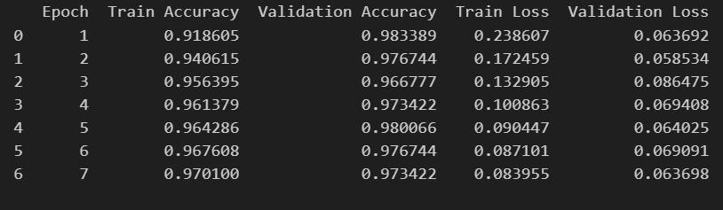

# Proyek Klasifikasi Gambar: Animal Image Classification Dataset

## Deskripsi
Proyek ini membangun pipeline klasifikasi gambar hewan (kucing, anjing, ular) menggunakan TensorFlow dan Transfer Learning (MobileNetV2). Pipeline meliputi: split dataset, augmentasi, training, evaluasi, visualisasi prediksi, serta konversi model ke SavedModel, TFLite, dan TensorFlow.js.

---

## 1. Download Dataset

Unduh dataset dari Kaggle:  
[Animal Image Classification Dataset (Kaggle)](https://www.kaggle.com/datasets/borhanitrash/animal-image-classification-dataset)

Struktur folder setelah ekstraksi:
```
datasets/
  animals/
    cats/
    dogs/
    snakes/
```

---

## 2. Setup Environment

- Install dependensi:
  ```bash
  pip install -r requirements.txt
  ```
- (Opsional) Jika di Colab, mount Google Drive:
  ```python
  from google.colab import drive
  drive.mount('/content/drive')
  ```
- Load Datasets:
  - Jika dataset di Google Drive, sesuaikan path seperti `/content/drive/MyDrive/...`.
  - Jika dataset di lokal (setelah download dari Kaggle), gunakan path lokal, misal:
    ```python
    dataset_path = "./datasets/cats"
    print(os.listdir(dataset_path))  # Pastikan folder cats, dogs, snakes sudah ada
    ```

---

## 3. Split Dataset

Pisahkan dataset menjadi Train (80%), Validation (10%), dan Test (10%).
Contoh kode split dapat dilihat di notebook/script.

---

## 4. Visualisasi Data

Tampilkan beberapa sampel gambar dari Train Set untuk memastikan dataset sudah benar.

---

## 5. Preprocessing & Augmentasi

Gunakan ImageDataGenerator untuk augmentasi (rotasi, zoom, flip, brightness) dan normalisasi gambar.

---

## 6. Membangun Model (Transfer Learning)

- Menggunakan MobileNetV2 (pre-trained, include_top=False) sebagai feature extractor.
- Tambahkan beberapa layer Conv2D, Pooling, Flatten, Dense, dan Dropout.
- Optimizer: Adam, Loss: categorical_crossentropy.

---

## 7. Training Model

- Training dengan EarlyStopping (patience=5).
- Validasi menggunakan validation set.

---

## 8. Evaluasi & Visualisasi

- Evaluasi model pada test set dan tampilkan akurasi.

  Contoh hasil:
  ```
  10/10 ━━━━━━━━━━━━━━━━━━━━ 13s 1s/step - accuracy: 0.9688 - loss: 0.1075
  Akurasi Model pada Test Set: 97.01%
  ```

- Visualisasi learning curve (akurasi/loss per epoch):
  
  

- Visualisasi Plot Akurasi & Loss:

  

- Tabel Akurasi & Loss
  

- Visualisasi prediksi model pada beberapa gambar test set:
  
  

---

## 9. Konversi Model

- SavedModel: `tf.saved_model.save(model, 'saved_model')`
- TFLite: Konversi dan simpan ke `model.tflite`
- TensorFlow.js: Konversi ke format web dengan `tensorflowjs_converter`

---

## 10. Catatan
- Pastikan dataset di-split secara mandiri.
- Model dapat digunakan di server (SavedModel), mobile (TFLite), dan web (TFJS).
- Untuk konversi ke TFJS di Colab:
  ```python
  !pip install tensorflowjs
  !tensorflowjs_converter --input_format=tf_saved_model saved_model tfjs_model
  ```

---
